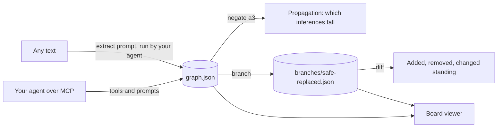

<p align="center">
  
</p>

<p align="center">
  <a href="https://github.com/y0sif/furcule/actions/workflows/ci.yml"></a>
  <a href="https://crates.io/crates/furcule"></a>
  <a href="LICENSE"></a>
  <a href="https://modelcontextprotocol.io"></a>
</p>

<p align="center"><strong>Find the fork in your reasoning.</strong></p>

Furcule is an open source, local-first reasoning graph. Give it any text, an idea you just dumped out loud, a research paper, a case file, a show's plot so far, and it becomes a directed graph of facts, assumptions and conclusions with provenance on every node. Negate an assumption and watch which conclusions lose support. Branch to explore an alternative with your own AI agent. Diff the branches side by side. Hunt for contradictions and loose ends.

Argument mappers such as Mindwrinkles, Argumentree and Kialo can surface hidden assumptions in a single argument, and a plain chat box can too. Furcule earns its place because it makes the assumption a first-class, toggleable node in a persistent graph, so negating one mechanically shows what falls and lets you branch, explore and diff. It is open source and local-first, works on any text at any scale, exports to open formats, and adds a checkable layer of dependency propagation and contradiction search that no shipping tool has. Your agent supplies the reasoning; Furcule is the referee.

> **Status: pre-alpha.** The schema, the CLI skeleton and `furcule schema` exist today. The engine, MCP server and viewer are being built in the open. The feature table below says what works now.

## Quick start

```bash
cargo install --git https://github.com/y0sif/furcule furcule
furcule schema graph            # the JSON Schema every graph file follows
```

Once the engine lands, the loop is:

```bash
furcule extract idea.md --out idea/        # facts, assumptions, conclusions, with provenance
furcule negate idea/ a3                    # what falls if assumption a3 is false
furcule branch idea/ safe-replaced         # start an alternative line of reasoning
furcule diff idea/ main safe-replaced      # what changed, and which conclusions moved
furcule serve idea/                        # open the board
```

## Installation

**From source, works today**

```bash
cargo install --git https://github.com/y0sif/furcule furcule
```

<details>
<summary>crates.io (planned for v0.1)</summary>

```bash
cargo install furcule
```
</details>

<details>
<summary>npx, for MCP configs (planned for v0.1)</summary>

```json
{ "mcpServers": { "furcule": { "command": "npx", "args": ["-y", "furcule", "mcp"] } } }
```
</details>

<details>
<summary>Arch Linux, Homebrew, pre-built binaries (planned for v0.1)</summary>

```bash
yay -S furcule                      # AUR
brew install y0sif/tap/furcule      # Homebrew tap
```

Pre-built archives for Linux, macOS and Windows will be attached to each GitHub release.
</details>

<details>
<summary>Claude Code plugin (planned for v0.1)</summary>

The `plugin/` directory is a Claude Code plugin that registers the MCP server and a `/furcule` skill, so the agent you already pay for does the extraction and the reasoning.
</details>

## How it works



Two halves. A **deterministic engine** stores the graph, computes standing, applies branches, diffs them and runs checks. A **reasoning driver** supplies the intelligence and can be your coding agent over local MCP, your chat app over a remote MCP connector, or later a hosted agent. Furcule never needs an API key of its own.

The safe scene that started the project:

```
fact       f1  The recordings are gone.
fact       f2  Only Red and Kaplan could open the safe. Kaplan is dead.
assumption a1  The only way to the recordings is to open the safe.    <- inferred, unverified
inference  i1  Someone opened the safe.                               <- supported by {f1, a1}

negate a1  ->  i1 falls
branch safe-replaced:
assumption a2  The whole safe was swapped for an empty replica.
inference  i2  Whoever built the safe could build its twin.           <- supported by {f1, a2}
```

Every node carries where it came from, `extracted`, `inferred` or `ambiguous`, and what you hold about it, `verified`, `unverified` or `negated`. Supports edges that share a group on the same target are a linked set, all needed; ungrouped edges are alternatives, any one is enough. An inference stands while one of its groups stands.

## Features

| Feature | Status |
|---|---|
| Graph schema with provenance and status on every node | done |
| `furcule schema` prints the JSON Schema | done |
| Extraction prompt and MCP tools for adding nodes and edges | planned, v0.1 |
| Negate an assumption, propagate standing through the graph | planned, v0.1 |
| Branches as ordered ops, git-diffable, `furcule diff` | planned, v0.1 |
| Checks: contradictions, unsupported inferences, orphans, gaps, cycles | planned, v0.1 |
| Reductio prompt: try to derive a contradiction from a conclusion | planned, v0.1 |
| Board viewer with overlay and split diff | planned, v0.1 |
| MCP over stdio for Claude Code and OpenCode | planned, v0.1 |
| MCP over streamable HTTP for Claude.ai and ChatGPT connectors | planned, v0.2 |
| Export to Argdown, JSON Canvas, GraphML | planned, v0.2 |
| SMT-backed validity for graphs that formalise cleanly | planned, v0.3 |

## Configuration

Zero config by default. Overrides, all optional:

| Variable | Default | Meaning |
|---|---|---|
| `FURCULE_GRAPHS` | `./` | Directory graphs are created in |
| `FURCULE_PORT` | `7429` | Port for `furcule serve` and the HTTP MCP transport |
| `FURCULE_BIND` | `127.0.0.1` | Bind address; keep it local unless you know why |
| `RUST_LOG` | `info` | Log level, logs go to stderr |

A config file at `~/.config/furcule/config.toml` with the same keys arrives with v0.1.

## CLI reference

| Command | Does |
|---|---|
| `furcule schema [graph\|branch]` | Print the JSON Schema |
| `furcule extract <file> --out <dir>` | Build a graph from text, with your agent doing the reading |
| `furcule add <dir>` | Add nodes or edges by hand |
| `furcule negate <dir> <node>` | Mark a node negated and report what falls |
| `furcule branch <dir> [name]` | Create or list branches |
| `furcule diff <dir> <a> <b>` | Diff two branches, or a branch against main |
| `furcule check <dir>` | Run consistency and gap checks |
| `furcule export <dir> --format <json\|argdown\|canvas\|graphml>` | Export |
| `furcule serve <dir>` | Serve the board and API locally |
| `furcule mcp` | Run the MCP server over stdio |

## Project structure

```
crates/furcule-core     graph model, propagation, branch + diff, checks, exports
crates/furcule-mcp      MCP server: stdio and streamable HTTP
crates/furcule-server   Axum: REST, SSE, serves the embedded viewer
crates/furcule          the one binary
viewer/                 Vite, React, React Flow board
fixtures/               six real-world cases with expected extractions
plugin/                 Claude Code plugin and skill
docs/                   architecture, schema, tech stack, comparison, faq, landscape
```

## Development

```bash
cargo test --workspace
cargo clippy --all-targets --all-features -- -D warnings
cargo fmt --all --check
cd viewer && pnpm install && pnpm build && pnpm lint
```

See [CONTRIBUTING.md](CONTRIBUTING.md) for the workflow and [docs/architecture.md](docs/architecture.md) for how the pieces fit.

## Documentation

- [Architecture](docs/architecture.md)
- [Graph schema](docs/schema.md)
- [Tech stack](docs/tech-stack.md)
- [Comparison with other tools](docs/comparison.md)
- [FAQ](docs/faq.md)

## License

MIT
